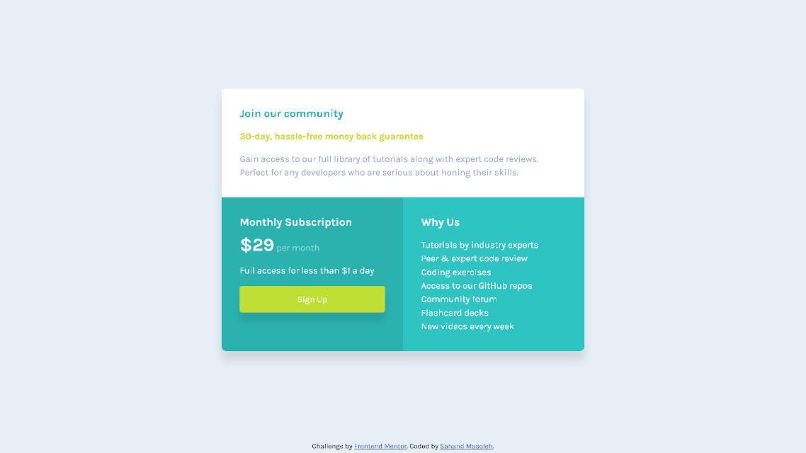

# Frontend Mentor - Single price grid component solution

This is a solution to the [Single price grid component challenge on Frontend Mentor](https://www.frontendmentor.io/challenges/single-price-grid-component-5ce41129d0ff452fec5abbbc). Frontend Mentor challenges help you improve your coding skills by building realistic projects.

## Table of contents

- [Overview](#overview)
  - [The challenge](#the-challenge)
  - [Screenshot](#screenshot)
  - [Links](#links)
- [My process](#my-process)
  - [Built with](#built-with)
- [Author](#author)

## Overview

### The challenge

Users should be able to:

- View the optimal layout for the component depending on their device's screen size
- See a hover state on desktop for the Sign Up call-to-action

### Screenshot

- Solution URL: [Github](https://github.com/sahand-masoleh/fem-14-single-price-grid-component)
- Live Site URL: [Github Pages](https://sahand-masoleh.github.io/fem-14-single-price-grid-component)

## My process

### Built with

- HTML & CSS only

## Author

- Frontend Mentor - [@sahand-masoleh](https://www.frontendmentor.io/profile/sahand-masoleh)
- Twitter - [@SahandMasoleh](https://twitter.com/SahandMasoleh)
